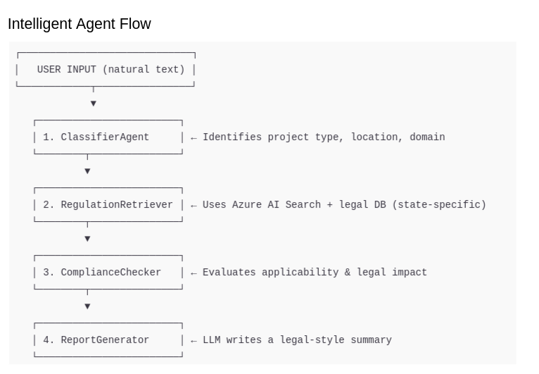
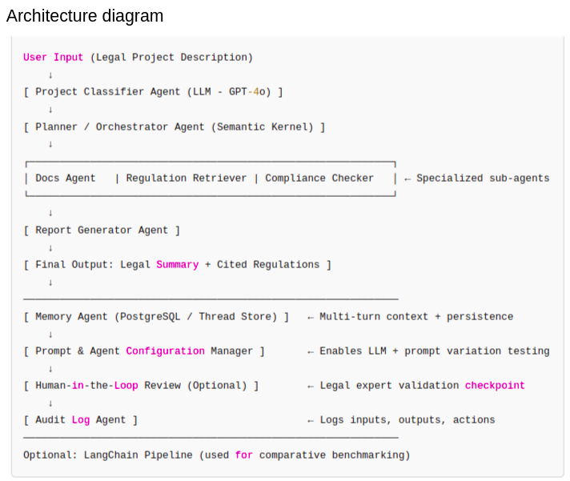

## LexAtlas: AI-Powered Legal Assistant for U.S. Regulations

**LexAtlas** is an intelligent, multi-agent legal assistant designed to help users understand which U.S. state-level laws and regulations apply to their projects. It identifies legal risks, recommends next steps, and generates clear legal-technical summaries based on natural language input.

LexAtlas is a submission for the [Microsoft AI Agents Hackathon](https://microsoft.github.io/AI_Agents_Hackathon/), showcasing how multi-agent AI systems can simplify legal compliance in complex, regulated environments.

---

You can explore the source code of the project in the following repositories:  
- [lexatlas-semantic-kernel](https://github.com/lexatlas-org/lexatlas-semantic-kernel)  
- [lexatlas-langchain](https://github.com/lexatlas-org/lexatlas-langchain)  

Additionally, you can watch a demonstration of the project on YouTube:  
[LexAtlas Demo Video](https://youtu.be/VvrS6FgVlLY)  

---

### What LexAtlas Does

Users can describe their project—such as an energy deployment, infrastructure plan, or environmental initiative—in natural language. LexAtlas will:

- Identify the project type and its U.S. jurisdiction.
- Retrieve relevant laws and regulations.
- Assess legal or compliance risks.
- Generate a human-readable legal summary.

The system is especially suited for early-stage planning when legal clarity is needed before contacting regulators or legal counsel.

---

### Example

**User Input:**

> We're planning a carbon capture project in Wyoming using DAC technology.

**LexAtlas Output:**

> Based on the input, this is a Wyoming-based industrial emissions project involving Direct Air Capture.  
> Under the Wyoming Environmental Quality Act, carbon capture requires authorization from the Department of Environmental Quality (DEQ), Section 35-11.  
> This project may qualify for incentives under the Wyoming Carbon Capture Program if geologic storage conditions are met.  
> We recommend contacting the DEQ’s Division of Air Quality for pre-permitting consultation.

---

### System Architecture Overview

LexAtlas is built using a modular, multi-agent AI architecture orchestrated by **Azure AI Agent SDK** and **Semantic Kernel**, deployed with **Chainlit** as a front-end interface.

#### Key Components

| Layer                     | Technology                                      | Purpose                                                             |
|---------------------------|--------------------------------------------------|---------------------------------------------------------------------|
| Frontend UI               | Chainlit                                         | Chat interface for users to interact with the AI assistant          |
| Language Model            | Azure OpenAI (GPT-4o)                            | Natural language understanding, classification, summarization       |
| Multi-Agent System        | Azure AI Agent SDK + Semantic Kernel            | Manages task delegation between specialized agents                  |
| Agent Roles               | Classifier, Retriever, Compliance Checker, Reporter | Each agent has a distinct role in processing legal queries         |
| Regulation Retrieval      | Azure AI Search       | Finds relevant state-level laws and structured legal data           |
| Memory Context | PostgreSQL Data Layer | Stores and retrieves prior user interactions and agent outputs to maintain conversational context, support multi-turn reasoning, and enable persistent project tracking. |
| Backend Integration       | Python + asyncio + Chainlit                     | Orchestrates user input, agent execution, and streaming responses   |
| Authentication            | Chainlit password-based login                   | Protects access for demo purposes                                   |

---

### Agent Flow

1. **Classifier Agent**  
   Determines the project type and jurisdiction based on user input.

2. **Regulation Retriever Agent**  
   Queries a semantic search index and structured database to find relevant legal texts.

3. **Compliance Checker Agent**  
   Analyzes retrieved content and checks for likely legal risks or non-compliance issues.

4. **Report Generator Agent**  
   Summarizes all findings into a clear, user-friendly report suitable for sharing or review.

All agents are orchestrated sequentially using Semantic Kernel's `AgentGroupChat` and strategy interfaces, with support for parallelism and iteration if expanded.

---

### Hackathon Development Strategy

The system was developed using a staged approach:

- **Phase 1:** Proof of concept with basic GPT-4o integration and roundtrip message flow.
- **Phase 2:** Core agent logic with project classification and legal retrieval using mock data.
- **Phase 3:** Memory integration, multi-turn follow-up, and UI polish via Chainlit.

This allowed for progressive testing and validation across each layer of functionality.

---

### How to Use

1. Launch the Chainlit web app.
2. Log in with demo credentials if required.
3. Describe your project in plain language (e.g., location, technology, purpose).
4. Receive a legal summary, list of relevant laws, and risk assessment instantly.

 

---

### Disclaimer

LexAtlas is an experimental legal assistant and does not provide certified legal advice. It is intended as a decision support tool. For critical legal decisions, consult a licensed attorney.
 
Here is the updated `README.md` with your additions in English, integrated smoothly into the document under a new technical section after **Hackathon Development Strategy**:

---

### Additional Engineering Strategy and Tools

To strengthen the system’s flexibility and reproducibility, the LexAtlas team implemented several advanced development strategies and tooling:

- **Parallel LangChain Prototype**  
  Alongside the core version built with Azure AI Agent SDK and Semantic Kernel, we developed a prototype using **LangChain**. This allowed us to evaluate differences in orchestration, agent chaining behavior, and prompt effectiveness between frameworks, providing valuable insights into performance and modularity trade-offs.

- **Azure Infrastructure Automation Scripts**  
  A suite of Bash and Python scripts was created to automate the provisioning and configuration of Azure services used in the platform:
  - Azure OpenAI deployment
  - Azure AI Search creation and indexing
  - Blob Storage setup and data ingestion
  - Cognitive Services + AI skillsets for pipeline enrichment  
  This infrastructure-as-code setup ensured consistent and rapid deployment across environments, streamlining both testing and production workflows.

- **Multi-Configuration LLM Prompt and Agent Management**  
  We developed tools to manage and test multiple LLM configurations—including agent definitions, prompts, and model variants. This allowed for:
  - Comparative evaluation of prompt effectiveness
  - Detection of multi-agent coordination issues
  - Rapid iteration across model capabilities (e.g., GPT-4o vs. GPT-35-turbo)  
  This modular approach improved system versatility and helped pinpoint performance bottlenecks and optimization opportunities throughout the agent chain.
  
  Here is a new section you can append at the end of the updated `README.md` to **explain the final architecture** of LexAtlas, based on all components and refinements developed:

### Final System Architecture Summary

The final architecture of **LexAtlas** integrates a clean, modular, and extensible multi-agent system designed to handle regulatory intelligence tasks with minimal user input. Here's how the system is structured:

-  **Central Agent Flow**: User input is parsed by a `Project Classifier Agent`, which feeds into a Semantic Kernel-based orchestrator. This orchestrator delegates tasks to domain-specific agents: `Docs Agent`, `Regulation Retriever`, and `Compliance Checker`. These outputs are then merged into a cohesive report by the `Report Generator`.

-  **Persistent Context**: A PostgreSQL-backed memory layer allows the assistant to maintain project context across sessions, enabling multi-turn legal advisory interactions.

-  **Agent Reconfiguration Layer**: A prompt and model configuration manager was developed to dynamically test variations in prompt styles and LLM configurations, supporting better evaluation of agent performance and reasoning chains.

-  **Deployment Automation**: The infrastructure layer is fully reproducible using custom Bash and Python scripts. These automate provisioning of Azure OpenAI, AI Search, Blob Storage, and skillsets for enrichment pipelines—ensuring ease of redeployment or scaling.

-  **Experimental Flexibility**: A LangChain-based prototype exists in parallel to benchmark different orchestration and tooling approaches, particularly around agent chaining, execution control, and traceability.

-  **Human and Logging Layers**:
  - **Optional Human-in-the-Loop Checkpoint** for legal expert validation.
  - **Audit Logging Agent** to track system inputs, outputs, and decisions for future governance and accountability.

This architecture balances cutting-edge AI orchestration with practical compliance needs, creating a system that is not only functional but also adaptable, testable, and legally aware from the ground up.
